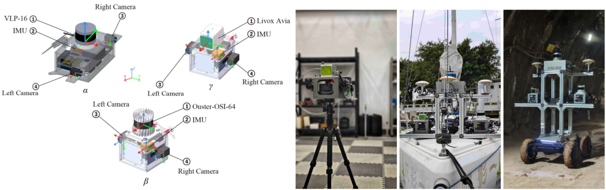
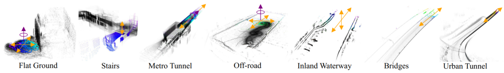
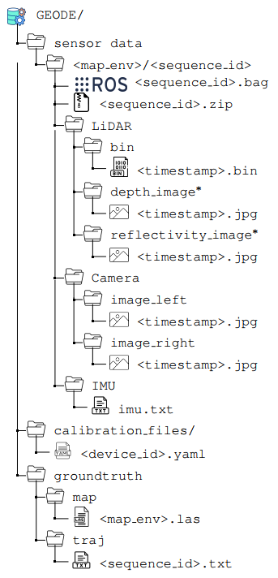
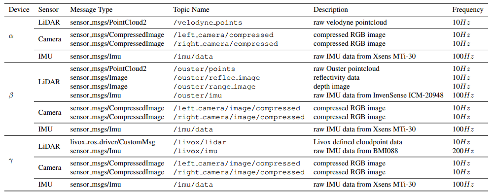
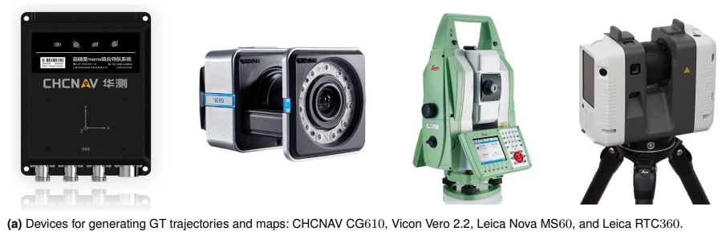
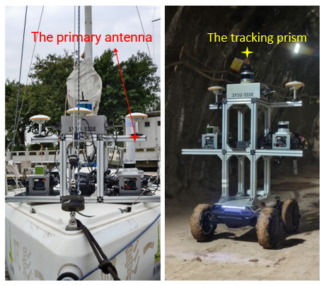

# GEODE Dataset

#### Heterogeneous LiDAR Dataset for Benchmarking Robust Localization in Diverse Degenerate Scenarios  

| [Webpage](https://thisparticle.github.io/geode/) | [Full Paper](https://arxiv.org/abs/2409.04961) |

> **TL;DR**: *A comprehensive multi-LiDAR, multi-scenario dataset that extensively incorporates segments of real-world geometric degeneracy.*





## News

- (20240910) Data can be downloaded from [GEODE - Google Drive](https://drive.google.com/drive/folders/1hEn3sBAvQhSdUFnGMZCCv-W0Ynj2rWBs?usp=sharing).
- (20240910) Dataset README is avaliable.

## Overview

### Usage Steps

1. Review the overview of the GEODE dataset, including details about sensors, definitions of ROS topics and messages, and important caveats regarding localization evaluation.
2. Download the dataset from [GEODE - Google Drive](https://drive.google.com/drive/folders/1hEn3sBAvQhSdUFnGMZCCv-W0Ynj2rWBs?usp=sharing). Additional information about each sequence and scenario is available on our homepage. Additional download options for users in Mainland China will be made available in the future.
3. Adapt your SLAM algorithm using the provided dataset parameters, and calculate the error after obtaining the results.

### Sensors

- Device $\alpha$:
  - Velodyne VLP-16  ;
  - Stereo HikRobot MV-CS050-10GC cameras;
  - Xsens MTi-30 IMU;
- Device $\beta$:
  - Ouster OS1-64;
  - Stereo HikRobot  MV-CS050-10GC cameras;
  - Xsens MTi-30 IMU;
- Device $\gamma$:
  - Livox AVIA;
  - Stereo HikRobot MV-CS050-10GC cameras;
  - Xsens MTi-30 IMU;

The GEODE dataset provides sensor raw data and corresponding rosbag.

<div style="text-align:left;">    </div>

Sensor raw data with * is only available for $\beta$ device.

#### ROS Topic and Explanation of Each Message



#### Sensor Calibration

The calibration results are stored in three files, `alpha.yaml`, `beta.yaml` and `gamma.yaml`, according to the acquisition device.

#### Ground-Truth Devices



### Localization Evaluation

We have provided the script 'rmse.py' for everyone to calculate the localization accuracy of the algorithms they run.

```python
python3 rmse.py <Your traj> <GT traj> <time offset>
```

For example, running the following command will calculate the error between all trajectories in TUM format that contain the `relead` field and the ground truth trajectories, and then compute the average value.

```python
python3 rmse.py relead <GT traj> 0
```



For the sequences 'off-road', 'inland_waterways', and 'Metro_Tunnels_Tunneling', three sets of equipment were mounted on a rack constructed from aluminum profiles to simultaneously collect data, while only one set of GT pose equipment was utilized to capture motion trajectories. Consequently, the trajectories obtained from the algorithm need to be processed before proceeding with subsequent error calculations. Fortunately, due to the effectiveness of the time synchronization scheme, we only need to account for the spatial offsets between different sensors in these sequences.

For the 'off-road' and 'inland_waterways' sequences, where GT poses are collected using GNSS/INS, we align the GT poses to the coordinate system of the beta device. This alignment allows the trajectories derived from the beta device's data, processed by the algorithm, to be directly used for error calculation. For the alpha and carol devices, the trajectories from the algorithm are transformed into the GT pose coordinate system using the scripts `alpha2gt_gnss.py` and ``gamma2gt_gnss.py` before error calculations are performed.

In the 'Metro_Tunnels_Tunneling' sequence, where GT poses are obtained by tracking prisms with a Leica MS60, we align the true values to the alpha device. The beta and gamma devices then convert the algorithm's trajectories to the GT pose coordinate system using the scripts `beta2gt_leica.py` and `carol2gt_leica.py`. The necessity of using scripts to transform coordinate systems, which requires additional operations to calculate errors, arises from the fact that the GT poses from the Leica tracking prisms include only positions, not attitudes. It is challenging to convert the true values to the other two devices using the results of multi-aLiDAR calibration. To maintain a unified processing approach, we adopt the same method for sequences recorded simultaneously.

For the “stair” sequence, we obtain the ground truth pose by using the [PALoc algorithm](https://github.com/JokerJohn/PALoc) to align the sensor data with the ground truth map. However, due to the small field of view of the Livox Avia LiDAR equipped with the $\gamma$ acquisition device, the odometry drifts, preventing us from obtaining the GT trajectory for the $\gamma$ acquisition device. Therefore, for this sequence, I propose to evaluate the localization errors of different algorithms by comparing the maps constructed by the odometry with the ground truth maps (Evaluation with [Cloud Map Evaluation Lib](https://github.com/JokerJohn/Cloud_Map_Evaluation)).

## Dataset Details and Download

Click the button below to access detailed information (including scenarios, degeneration types, etc.) and to download the dataset.

[Homepage of GEODE dataset](https://geode.github.io/)

## Related Links

[Awesome-Algorithms-Against-Degeneracy](https://github.com/thisparticle/Awesome-Algorithms-Against-Degeneracy)

### Dataset

* SubT-MRS: Pushing SLAM Towards All-weather Environments, CVPR, 2024. [[Paper](https://openaccess.thecvf.com/content/CVPR2024/papers/Zhao_SubT-MRS_Dataset_Pushing_SLAM_Towards_All-weather_Environments_CVPR_2024_paper.pdf)] [[website](https://superodometry.com/datasets)]
* [ENWIDE Dataset](https://projects.asl.ethz.ch/datasets/enwide) (related paper: COIN-LIO: Complementary Intensity-Augmented LiDAR Inertial Odometry, ICRA, 2024. [[arXiv](https://arxiv.org/abs/2310.01235)] [[code](https://github.com/ethz-asl/COIN-LIO)])
* [LiDAR Degeneracy Datasets](https://github.com/ntnu-arl/lidar_degeneracy_datasets) (related paper: COIN-LIO: Complementary Intensity-Augmented LiDAR Inertial Odometry, ICRA, 2024. [[arXiv](https://arxiv.org/abs/2310.01235)] [[code](https://github.com/ethz-asl/COIN-LIO)])
* WHU-Helmet: A helmet-based multi-sensor SLAM dataset for the evaluation of real-time 3D mapping in large-scale GNSS-denied environments, IEEE Transactions on Geoscience and Remote Sensing, 2023. [[paper](https://ieeexplore.ieee.org/document/10123040/)] [[website](https://github.com/kafeiyin00/WHU-HelmetDataset)]

* Open-source datasets released by the SubT teams
  * [CERBERUS](https://www.subt-cerberus.org/code--data.html)
  * [CoSTAR](https://github.com/NeBula-Autonomy)
  * [CTU-CRAS-Norlab](https://github.com/ctu-mrs/slam_datasets)
  * [Explorer](https://theairlab.org/dataset/interestingness)
  * [MARBLE  COLORADAR DATASET](https://arpg.github.io/coloradar/)

## Publications

1. **Heterogeneous LiDAR Dataset for Benchmarking Robust Localization in Diverse Degenerate Scenarios**
   Zhiqiang Chen, Yuhua Qi, Dapeng Feng, Xuebin Zhuang, Hongbo Chen, Xiangcheng Hu, Jin Wu, Kelin Peng, Peng Lu
   *Under Review*
   [[Arxiv\]](https://arxiv.org/abs/2409.04961)

## Contact

If you have any other issues, please report them on the repository.
